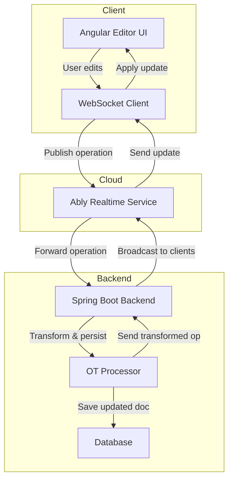

# 📄 Collab Doc Editor

A real-time collaborative text editor built using **Angular**, **Spring Boot**, **WebSockets**, and **Quill.js**. It features **Operational Transformation (OT)** for conflict resolution, **live cursor presence**, and **active users tracking** using **Supabase**, enabling smooth and consistent multi-user editing experiences.

---


##


##


## 🚀 Features

- Real-time collaborative editing
- Conflict resolution using Operational Transformation
- Live cursor presence across users
- Active user tracking with Supabase Realtime
- Clean and responsive UI using Quill.js

---

## 🧩 Tech Stack

### **Frontend**
- **Framework:** Angular (SSR)
- **Realtime Transport:** Ably Realtime (WebSockets)
- **State Management:** RxJS + Custom OT Handler
- **UI:** TailwindCSS + Angular Material
- **Auth:** Firebase Authentication
- **Presence Tracking:** Supabase Realtime

### **Backend**
- **Framework:** Spring Boot (Java)
- **Collaboration Engine:** Operational Transformation (OTProcessor)
- **Messaging:** Ably Realtime (for broadcasting edits)
- **Inter-Service Communication:** Apache Kafka
- **Database:** MongoDB Atlas (for documents, metadata, and versions)
- **Auth Integration:** Firebase Auth
- **Presence & Collaboration Data:** Supabase Realtime

### **Microservices**
- **Thumbnail Service:** Node.js + Puppeteer  
  - Consumes Kafka events to generate document thumbnails  
  - Stores rendered thumbnails in Google Cloud Storage (GCS)


## 🏗️ Architecture Overview


 
```
---

## 📦 Setup Instructions

### Prerequisites
- Node.js v18 or higher
- Git

### Steps to Run Locally

```bash
# Clone the repository
git clone <your-repo-url>
cd collab-doc-editor

# Install dependencies
npm install

# Start the frontend server
npm start
```
---
